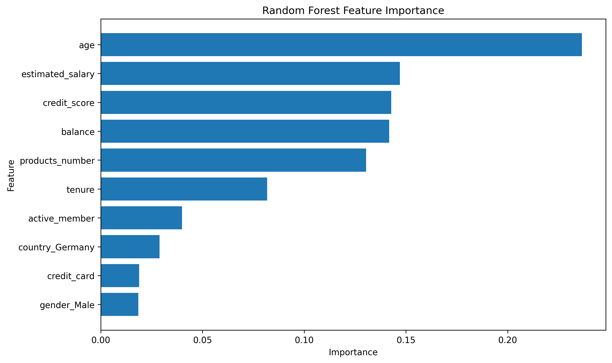
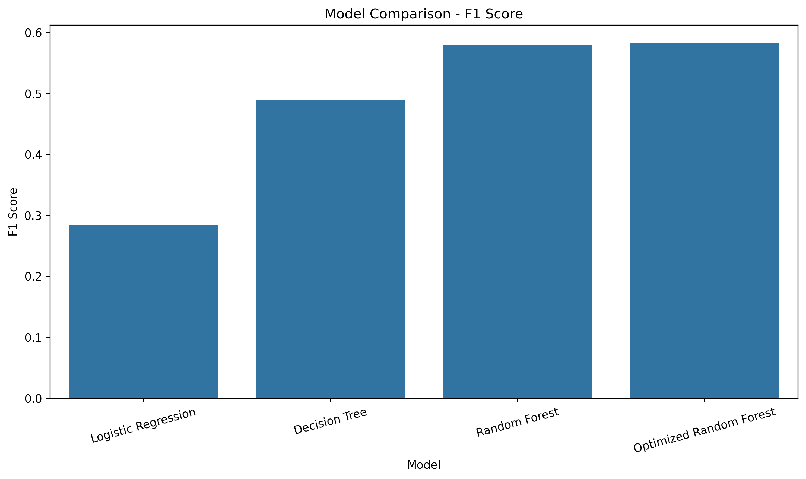

# Bank Customer Churn Prediction

## Project Overview

This project analyzes customer churn in a banking dataset and builds machine learning models to predict which customers are more likely to leave a bank. 

I cleaned and prepared the customer data and performed exploratory analysis to understand the main patterns between customers who stayed and those who churned. 

I then trained Logistic Regression, Decision Tree and Random Forest classification models using demographic, financial and account-related information. Finally, I used GridSearchCV to tune the Random Forest model and compared its performance with the original models.

The optimized Random Forest achieved an accuracy of 86.55% and a ROC-AUC score of 0.8581.


## Project Objectives

The main objectives were to:

- Analyze customer characteristics linked to churn.
- Perform exploratory data analysis (EDA).
- Prepare the dataset for machine learning.
- Train different classification models.
- Compare the models using evaluation metrics.
- Improve the Random Forest model using GridSearchCV.
- Identify important features that contributed the most to the model's predictions.
- Evaluate the final model using ROC-AUC and Precision-Recall analysis.
- Convert the findings into practical business recommendations.

## Skills Demonstrated

- Data cleaning and preprocessing
- Exploratory data analysis
- Data visualization
- Feature engineering
- Classification modelling
- Model evaluation
- Hyperparameter tuning
- Feature importance analysis
- Business interpretation
- Python programming

## Installation

### Prerequisites

- Python 3.8 or higher
- pip (Python package manager)

### Setup

1. Clone the repository:

```bash
git clone <your-repository-url>
cd bank-customer-churn-prediction
```

2. Install the required dependencies:

```bash
pip install -r requirements.txt
```

Alternatively, install the packages individually:

```bash
pip install pandas numpy matplotlib seaborn scikit-learn jupyter
```

3. Download the dataset from [Kaggle](https://www.kaggle.com/datasets/saurabhbadole/bank-customer-churn-prediction-dataset) and place it in the `data/` folder.

## Usage

The complete analysis is contained in the project notebook.

## Notebook

The complete analysis and machine learning workflow can be found in the project notebook:

[View the Jupyter Notebook](notebooks/Bank_Customer_Churn_Prediction.ipynb)

### Google Colab

1. Open [Google Colab](https://colab.research.google.com/).
2. Select `File` → `Upload notebook`.
3. Upload the project notebook from the `notebooks/` folder.
4. Upload `Bank Customer Churn Prediction.csv` to the Colab Files panel.
5. Update the dataset path in the notebook if necessary.
6. Select `Runtime` → `Run all`.

### Local Jupyter Notebook

To run the notebook locally:

```bash
jupyter notebook notebooks/Bank_Customer_Churn_Prediction.ipynb
```
## Dataset

The dataset was obtained from [Kaggle](https://www.kaggle.com/datasets/saurabhbadole/bank-customer-churn-prediction-dataset)

It included the following variables:

- credit_score
- country
- gender
- age
- tenure
- balance
- products_number
- credit_card
- active_member
- estimated_salary
- churn

The target variable was Churn:

- `0` = Customer stayed
- `1` = Customer churned

Approximately 20.37% of customers in the dataset were classified as churned. 
This created an imbalanced target variable, since the majority of customers remained with the bank.

## Technologies Used

- Programming Language: Python
- Libraries: Pandas, NumPy, Matplotlib, Seaborn, Scikit-learn
- Data Source: Kaggle
- Development Environment: Google Colab
- Version control: GitHub

## Machine Learning Methods:

- Logistic Regression
- Decision Tree
- Random Forest
- GridSearchCV
- Feature Importance
- ROC-AUC
- Precision-Recall Analysis

## Repository Structure

```text
bank-customer-churn-prediction/
├── data/
│   └── Bank Customer Churn Prediction.csv
├── images/
│   ├── churn_distribution.png
│   ├── confusion_matrix_logistic.png
│   ├── confusion_matrix_random_forest.png
│   ├── confusion_matrix_tree.png
│   ├── feature_importance.png
│   ├── heatmap.png
│   ├── model_comparison_f1.png
│   ├── precision_recall_curve.png
│   └── roc_curve.png
├── notebook/
│   └── Bank_Customer_Churn_Prediction.ipynb
├── results/
│   ├── feature_importance.csv
│   └── model_comparison.csv
├── README.md
└── requirements.txt
```

## Results

The model comparison and feature importance results are available here:

- [Model Comparison](results/model_comparison.csv)
- [Feature Importance](results/feature_importance.csv)

## Exploratory Data Analysis (EDA)

The exploratory analysis helped me understand the dataset structure and identify differences between customers who stayed and customers who churned.

My main observations were:

- Around 20.37% of customers in the dataset churned.
- Customer churn was not evenly distributed across the dataset, confirming that the target variable was imbalanced.
- Several demographic and financial variables showed differences between customers who stayed and those who churned.


## Feature Importance

The Random Forest model was used to identify which features contributed most to its churn predictions.

The top features were:

|Feature | Importance |
| --- | --- |
| Age | 0.2365 |
| Estimated Salary | 0.1470 |
| Credit Score | 0.1428 |
| Balance | 0.1418 |
| Products Number | 0.1304 |
| Tenure | 0.0818 |
| Active Member | 0.0399 |
| Country (Germany) | 0.0289 |
| Credit Card | 0.0188 |
| Gender (Male) | 0.0185 |

Age had the highest importance at 0.2365. This means that age contributed the most to the Random Forest's predictions. 

Feature importance describes the variables used by the model. It does not prove that any of the variables cause a customer to churn.


## Model Performance

I evaluated the models using accuracy, precision, recall and F1-score for the churn class.

| Model | Accuracy | Precision | Recall | F1 Score |
|---|---|---|---|---|
| Logistic Regression | 80.80% | 59% | 19% | 28% |
| Decision Tree | 78.25% | 47% | 51% | 49% |
| Random Forest | 86.40% | 78% | 46% | 58% |
| Optimized Random Forest | 86.55% | 79% | 46% | 58% |

The optimized Random Forest performed the best overall. 

Its results were:

- Accuracy: 86.55%
- Precision for churn: 79%
- Recall for churn: 46%
- F1-score for churn: 58%
- ROC-AUC: 0.8581

Although the model achieved high accuracy, its recall shows that it identified less than half of the customers who actually churned.


## ROC-AUC Analysis

The optimized Random Forest achieved a ROC-AUC score of 0.8581, suggesting that the model can distinguish between customers who churn and customers who remain with the bank very well.
However, ROC-AUC should be considered alongside recall and precision because it evaluates discrimination across different classification thresholds, while the classification report reflects performance at the selected threshold.

## Key Findings

The main findings I learnt from the analysis were:

- Approximately 20.37% of customers in the dataset had churned.
- The target variable was imbalanced, with customers who stayed making up the majority of the dataset.
- Age was the most important feature in the Random Forest model, followed by estimated salary, credit score, balance and number of products.
- The optimized Random Forest achieved the highest accuracy at 86.55%.
- The optimized model achieved a ROC-AUC score of 0.8581, indicating good overall ability to distinguish between customers who churned and those who stayed.
- Despite its overall performance, the model's 46% recall for churn shows that many customers who actually churned were still missed.

## Business Recommendations

Based on the analysis, I would suggest the following possible actions:

1. The bank could use the predicted churn probabilities to identify which customers need to be prioritized.

2. Further analysis could be used to understand why certain demographic or account groups have higher churn rates.
 
3. High-risk customers could receive personalized offers, support or engagement before they decide to leave.

4. Customer behaviour can change over time, so the model should be evaluated regularly and retrained when its performance begins to decline.

## Limitations and next steps

The optimized Random Forest model achieved a high overall accuracy of 86.55% but its recall for the churn class was 46%, meaning that the model failed to identify 54% of customers who actually churned. 
This result is partly related to the imbalance in the target variable, where only 20.37% of customers churned. Because of this, accuracy alone can give an overly positive impression of the model’s performance.

My next step is investigating different classification thresholds to improve recall. This would allow the model to identify more potential churners, although it would probably also increase the number of false positives. 
Other possible improvements include class weighting, resampling methods and additional model calibration.


